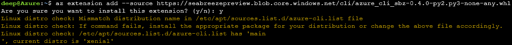

<<<<<<< HEAD
---
title: Frequently asked Questions and Known Issues
description: Quick start guide on deploying Container Group Set.
services: Azure SeaBreeze
author: chackdan;
manager: timlt

ms.service: SeaBreeze
ms.topic: overview
ms.assetid:
ms.topic: article
ms.date: 03/22/2018
ms.author: chackdan
ms.editor: chackdan
---

# Frequently Asked Questions and Known Issues.
=======
# Frequently asked questions and Known Issues.
>>>>>>> 7057c30a1391943ca2f5a8b1446ff01715e127ea

## Quota and Cost

**What is the cost of participating in the preview?**

 There are no charges for deploying applications or containers to Seabreeze preview. However we encourage you to delete the resources you deploy and not leave them running, unless you are actively testing it.

**Is there a quota limit of the # of Cores and RAM?**

Yes, you are allocated restricted quota for use in the preview.

-  You are allocated a total of 6 Cores and 24-GB RAM.
-  The largest container you can deploy is limited to 2 cores, 8-GB RAM.
-  You can allocate partial cores to your containers. 

**Can I leave my application running overnight?**

<<<<<<< HEAD
**Can I leave my application running overnight ?**

Yes, you can, however we expect you to delete the resources you deploy and not leave it running, unless you are actively testing it. This policy may change in the future and we may delete the resources, if they are being misused.

### Constraints on the base Images
Windows : tbd
Linux : tbd
=======
Yes, you can, however we encourage you to delete the resources you deploy and not leave them running, unless you are actively testing it. This policy may change in the future and we may delete the resources, if they are being misused.

## Required container base images
The following container bases images can be used when deploying services

- Windows: TBD
- Linux: TBD
>>>>>>> 7057c30a1391943ca2f5a8b1446ff01715e127ea

## Features Gaps and Known Issues

**After deploying my application, the network resource associated with it does not seem to an IP address**

There is a known issue today with the IP address coming up after a delay. Check the status of the network resource in a few minutes to see the associated IP address.

**My application is failing to access the right network/volume resource**

In your application model, you need to use the full resource id for networks and volumes to be able to access the associated resource. Here is what this looks like in the quickstart sample we provide:

```json
"networkRefs": [
    {
    "name":  "[resourceId('Microsoft.ServiceFabric/networks', 'SbzVotingNetwork')]" 
    }
]
```

**I do not see the current application model supporting a way to encrypt my secrets**

<<<<<<< HEAD
This is a gap in public preview 2. We are working on a secret store service to help with this.
=======
Yes, this is a gap in Private Preview 2. We are working on a secret store service to help with this and expect to have this in Preview 3. 
>>>>>>> 7057c30a1391943ca2f5a8b1446ff01715e127ea

**I get this error when using the CLI module _ImportError: cannot import name 'sdk_no_wait'**

If you are using older CLI version than 2.0.30, you may get this error -

```
cannot import name 'sdk_no_wait'
Traceback (most recent call last):
File "C:\Program Files (x86)\Microsoft SDKs\Azure\CLI2\lib\site-packages\knack\cli.py", line 193, in invoke cmd_result = self.invocation.execute(args)
File "C:\Program Files (x86)\Microsoft SDKs\Azure\CLI2\lib\site-packages\azure\cli\core\commands_init_.py", line 241, in execute self.commands_loader.load_arguments(command)
File "C:\Program Files (x86)\Microsoft SDKs\Azure\CLI2\lib\site-packages\azure\cli\core_init_.py", line 201, in load_arguments self.command_table[command].load_arguments() # this loads the arguments via reflection
File "C:\Program Files (x86)\Microsoft SDKs\Azure\CLI2\lib\site-packages\azure\cli\core\commands_init_.py", line 142, in load_arguments super(AzCliCommand, self).load_arguments()
File "C:\Program Files (x86)\Microsoft SDKs\Azure\CLI2\lib\site-packages\knack\commands.py", line 76, in load_arguments cmd_args = self.arguments_loader()
File "C:\Program Files (x86)\Microsoft SDKs\Azure\CLI2\lib\site-packages\azure\cli\core_init_.py", line 332, in default_arguments_loader op = handler or self.get_op_handler(operation)
File "C:\Program Files (x86)\Microsoft SDKs\Azure\CLI2\lib\site-packages\azure\cli\core_init_.py", line 375, in get_op_handler op = import_module(mod_to_import)
File "C:\Program Files (x86)\Microsoft SDKs\Azure\CLI2\lib\importlib_init_.py", line 126, in import_module return _bootstrap._gcd_import(name[level:], package, level)
File "", line 978, in _gcd_import
File "", line 961, in _find_and_load
File "", line 950, in _find_and_load_unlocked
File "", line 655, in _load_unlocked
File "", line 678, in exec_module
File "", line 205, in _call_with_frames_removed
File "C:\Users\annayak.azure\cliextensions\azure-cli-sbz\azext_sbz\custom.py", line 18, in 
from azure.cli.core.util import get_file_json, shell_safe_json_parse, sdk_no_wait
ImportError: cannot import name 'sdk_no_wait'.
<<<<<<< HEAD

**I get a mismatch distribution name error when installing the CLI extension package**



This does not mean that the extension did not install. You should still be able to use the CLI commands without a problem.
=======
```
>>>>>>> 7057c30a1391943ca2f5a8b1446ff01715e127ea

**When I scale out, I see that all my containers are affected, including my running ones**

This is a bug, and we expect to fix this with the next runtime refresh.


